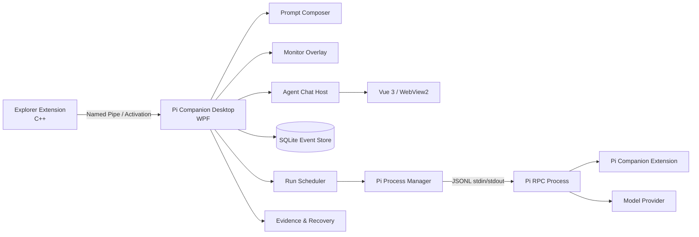

# Pi Companion 产品计划与技术规格

> 文档状态：实施基线
> 版本：0.4
> 更新日期：2026-07-30
> 目标平台：Windows 11 x64
> 目标阶段：MVP → Feature-complete Alpha → Feature-complete Beta → 正式发布（1.0）

## 1. 文档目的

本文档定义 Pi Companion 的产品范围、用户工作流、技术架构、模块边界、运行协议、数据模型、安全策略、质量要求和分阶段交付计划。它是后续设计、开发、测试和验收的共同基线。没有明确标为“计划”“目标”或“待验证”的内容应与当前 `main` 保持一致；精确协议版本、依赖版本和测试数量以源码、lockfile 与当前 CI 为准。

实施过程中允许通过 Architecture Decision Record（ADR）修订技术细节，但以下核心方向默认保持稳定：

- Explorer-first，而不是从聊天主窗口开始所有任务。
- Prompt Composer、Monitor 和 Agent Chat 共享同一套任务、运行、对话与证据数据。
- Windows 外壳和 Overlay 使用原生 WPF。
- Agent Chat 使用 Vue 3，并通过 WebView2 嵌入 WPF 主窗口。
- Agent 引擎通过 Pi RPC 运行在独立子进程中。
- UI 不直接依赖 Pi 原始协议，统一消费 Pi Companion 领域事件。
- 工作目录是默认策略边界，但 MVP 不把它描述成操作系统级沙箱。
- 每个开发阶段结束时必须提供明显、可运行、可操作的用户可见成果。
- 优先复用 Pi 和通用 Agent 的原生能力；管理 UI 只解决本机状态可见性与必要的安全操作，不把已有 Agent 工作流重复产品化。

## 2. 产品定义

Pi Companion 是一款面向 Windows 11 的 Explorer-first 本地 AI Agent。

用户可以直接在资源管理器中对当前目录或选中文件唤起 Prompt Composer Overlay 并提交任务；通过常驻桌面的 Monitor Overlay 监督执行、处理权限和提问、调整 Agent 的工作方向，以及审查文件变更、命令、测试和最终结果；同时，应用保留独立的 Agent Chat 主窗口，用于查看完整过程并进行连续对话。

### 2.1 产品目标

1. 将 Agent 入口放进用户现有的 Windows 文件工作流。
2. 让长时间运行的任务在不占据主窗口的情况下保持可见、可控。
3. 让权限请求、Agent 提问和任务方向调整能在桌面上及时完成。
4. 对 Agent 的命令、文件修改、测试和最终结论提供可审查证据。
5. 保留完整聊天界面，满足深度查看和连续对话需求。
6. 保证应用、任务和 Agent 进程异常退出后仍能恢复历史和上下文。
7. 在 1.0 正式发布前覆盖已确认的后续功能方向；其具体目标、边界和方案在对应阶段开始前讨论确定。

### 2.2 非目标

以下能力不属于当前 1.0 正式发布范围：

- 跨平台支持。
- 内核级或虚拟机级强沙箱。
- 云端任务同步。
- 多用户团队协作。
- MCP 与 Recipes 的完整管理 UI。
- 第三方外观市场。
- 对任意 Shell 命令产生的所有文件系统变化做绝对可靠的自动回滚。
- 移动端伴侣应用。

## 3. 核心设计原则

### 3.1 Explorer-first

用户不需要先打开主窗口、创建项目或导入仓库。目录本身就是一次任务的执行范围和默认安全边界。

### 3.2 单一事实来源

Monitor 和 Agent Chat 不维护各自独立的任务状态。所有可见状态来自同一套事件存储和领域投影。

### 3.3 状态更新不抢焦点

Monitor 可以改变颜色、动画、文字和内容，但不得因后台状态变化主动调用窗口激活。

### 3.4 权限在执行端强制

Monitor 和 Chat 负责显示请求及收集答案，实际允许或阻止操作的逻辑必须位于 Agent 执行链路中。

### 3.5 证据优先

文件变化、测试结果和命令状态必须来自实际工具与进程记录，不能只依赖 Agent 最终文字声明。

### 3.6 可替换的 Agent 后端

应用通过 `IAgentBackend` 使用 Agent 能力。MVP 实现为 `PiRpcBackend`，将来可以增加 SDK 或其他 Agent 实现，而不改写主要 UI 和数据模型。

## 4. 用户核心工作流

### 4.1 从 Explorer 直接开始任务

1. 用户在 Explorer 中打开一个目录。
2. 用户右键空白处，或预先选中一个或多个文件/文件夹。
3. 用户点击 `Ask Pi Companion`。
4. Prompt Composer 出现在原鼠标或上下文菜单附近。
5. 用户确认目录和附件，输入任务，选择模型与推理等级。
6. 用户点击“开始工作”。
7. Composer 关闭，任务进入队列或开始执行，Monitor 出现。

### 4.2 把草稿带入完整聊天

1. 用户在 Prompt Composer 中准备目录、附件、模型、推理等级和输入草稿。
2. 用户点击“打开聊天界面”。
3. Agent Chat 打开并显示草稿。
4. 此时不创建 Run，也不启动 Pi。
5. 用户在 Chat 中确认发送后才开始执行。

### 4.3 在 Monitor 中监督任务

1. 胶囊显示当前最高优先级任务的标题和状态。
2. 用户点击展开图标后查看目录、模型、推理等级、活动流和队列。
3. Agent 请求权限或提出问题时，Monitor 切换到交互内容。
4. 用户可以批准、拒绝、回答、立即调整或排队后续任务。
5. 任务完成后，Monitor 保留精简结果，直到用户确认。

### 4.4 在 Agent Chat 中深入查看和继续

1. 用户从 Monitor、Composer 或历史列表进入 Agent Chat。
2. 用户查看完整消息、思考、工具调用、命令、Diff、测试与警告。
3. 如果任务仍在运行，用户选择立即调整或完成后继续。
4. 如果任务已结束，用户可以直接继续该任务。

## 5. MVP 产品范围

### 5.1 MVP 必须包含

#### Explorer 集成

- Windows 11 现代右键菜单中的 `Ask Pi Companion`。
- 支持目录背景、单文件、多文件、单文件夹及混合选择。
- 传递工作目录、选中路径、鼠标位置和调用来源。
- 应用未运行时启动，已运行时复用现有实例。

#### Prompt Composer

- 当前目录。
- 附件列表及移除操作。
- 可调整尺寸的多行输入框。
- 模型和推理等级选择。
- 快捷键提示。
- 取消、打开 Agent Chat 和开始工作操作。
- Always-on-top、多显示器、DPI 和屏幕边缘避让。

#### Monitor Overlay

- Capsule 与 Expanded 两种视觉状态。
- 图标化显式展开/收起和离开后的自动收起。
- 运行、等待用户、完成和失败状态。
- 精简活动流。
- 权限批准和 Agent 提问。
- Steer 与 Follow-up 输入。
- 精简结果、文件变化、测试状态、警告和恢复入口。
- 双击打开 Agent Chat。

#### Agent Chat

- 新对话前选择目录。
- Task 创建后锁定工作目录；切换目录必须新建 Task。
- 近期任务、完整历史、搜索、筛选和回收站。
- 可收起、可调宽的左侧任务栏。
- 完整消息、思考、工具调用、命令、交互请求和运行状态。
- 最终结果、文件变化、Diff、测试、警告和恢复操作。
- 运行时 Steer/Follow-up，结束后继续任务。

#### Agent Runtime

- Pi RPC 生命周期管理。
- Prompt、Steer、Follow-up、Abort。
- 模型和推理等级管理。
- Session 持久化和恢复。
- 权限拦截与 Agent 提问。
- 文件、命令、测试和结果证据。

### 5.2 正式发布（1.0）前必须包含

- Skill 管理（已完成）。
- 预置任务和定时任务。
- Git 写入能力。
- Web Search。
- 直接对话（内部 Scope：GeneralChat）。
- 多任务并发和多任务 Monitor。
- Monitor 桌面宠物模式与自定义外观。

除已完成并在本文固化边界的 Skill 管理外，本节其余条目只确认正式发布前的功能方向，不预设具体产品目标、交互、技术实现或验收标准；这些内容在进入对应阶段时再讨论并更新本文档。

### 5.3 暂时不做，后续可能考虑

以下能力不属于当前 1.0 承诺。只有出现明确、持续的真实需求，并重新确认其不与 Pi 的简洁、可组合理念冲突时，才重新立项：

- 工作目录文件浏览器及可折叠上下文侧栏。
- MCP、Recipes 和其他上下文视图的完整管理体验。
- 第三方 Skill 或外观市场。
- Companion 自建的 Skill 库、package 模型、收藏和远端技能目录。
- AI 查找、下载和安装 Skill 的专用 Host 工作流、技能助手页面或提案卡；现阶段由 AI 直接使用生态中的 `find-skills` 等能力。
- AI 创建 Skill 的 Companion 专用工作流及随应用私有编排的 `skill-creator`；现阶段由 AI 直接使用已有 `skill-creator` 等能力。
- Skill 创建表单、内置编辑器、分类、评分、评测平台和第二套工作区技能界面。
- 根据当前任务或页面上下文静默推断 Skill 安装目标。
- ARM64 安装包。

## 6. 技术栈

| 层 | 选型 | 说明 |
|---|---|---|
| Windows 桌面外壳 | C#、.NET 10、WPF | 多窗口、透明窗口、托盘和 Win32 互操作 |
| Windows 能力 | Win32、Windows SDK | DWM、激活、显示器、DPI、窗口层级、注册表和 Job Object |
| Agent Chat | Vue 3、TypeScript、Vite | 内容密集型聊天与证据界面 |
| Chat 状态 | Pinia | 只保存 UI 投影，不作为任务权威状态 |
| Chat 宿主 | 标准 WebView2 | 嵌入 WPF，优先保证窗口缩放流畅度；加载态与 WebView 不重叠 |
| Explorer 扩展 | C++20/WinRT、`IExplorerCommand` | Windows 11 现代上下文菜单 |
| Agent 引擎 | Pi RPC | 跨语言、独立进程、流式事件和交互请求 |
| Agent 定制 | Pi Companion Extension | 权限、路径、备份、证据和工具策略 |
| 数据库 | SQLite、Microsoft.Data.Sqlite | 本地任务、事件、历史与证据 |
| 进程管理 | Windows Job Object | 终止完整子进程树和资源管理 |
| 桌面 IPC | Named Pipe | Explorer 激活和未来进程拆分 |
| 日志 | 应用自有 UTF-8 文件日志 | Pi stderr、元数据诊断、保留期限和诊断导出 |
| 开发安装 | 未签名稀疏 MSIX | 当前用户 Explorer COM 注册与重复覆盖验证 |

版本策略：

- .NET 使用当前受支持的 LTS 基线。
- Pi Runtime 随正式应用私有发布并锁定兼容版本。
- 带 `PiCompanion.Development` 标记的开发构建优先使用本机全局安装的 Pi；正式发布构建不调用用户全局 Pi。
- npm 和 NuGet 依赖均使用 lockfile。
- 正式 MSIX、代码签名、更新和卸载仍是发布阶段目标，不属于当前开发安装能力。

## 7. 系统架构



### 7.1 当前进程边界

当前实现包含以下进程：

1. `PiCompanion.Desktop.exe`
   - 托盘常驻进程。
   - 持有 Prompt Composer、Monitor 和 Agent Chat；设置中心显示在 Agent Chat 内。
   - 管理数据库、调度器和 Pi 子进程。
2. `PiCompanion.ExplorerCommand.dll`
   - 由 Windows Shell 通过 COM 扩展机制调用。
   - 只解析选择项和发送激活请求。
3. Pi RPC 子进程
   - 按正在执行的 Run 创建。
   - 在任务工作目录中运行。
   - 加入 Windows Job Object。

当前调度器固定 `MaximumConcurrentRuns = 2`。一次 Run 对应一个 Pi 子进程；同一 Task 和同一规范化工作目录保持串行，不同工作目录与独立 General Chat 托管目录可以并发。并发上限暂不开放给用户配置。

## 8. 模块职责

### 8.1 Explorer Extension

负责：

- 获取选中项目。
- 确定当前目录。
- 获取鼠标位置和 Explorer 窗口句柄。
- 构造版本化 Activation Payload。
- 通过 Named Pipe 发送给已有实例。
- 必要时启动桌面应用。
- 快速返回。

禁止：

- 初始化模型或 Pi。
- 打开数据库。
- 启动 WebView2。
- 扫描大量文件。
- 等待任务创建或 Overlay 完整显示。

### 8.2 Desktop Application

负责：

- 单实例和激活路由。
- 托盘生命周期。
- 顶层窗口创建和位置管理。
- 任务命令、查询和状态投影。
- SQLite 持久化。
- 调度和 Pi 进程管理。
- WebView2 Bridge。
- 设置、日志和诊断。

### 8.3 Prompt Composer

只负责收集和提交任务草稿，不展示运行状态。

### 8.4 Monitor

显示当前最高优先级任务的精简投影，并提供高频交互。它不直接写数据库，也不直接向 Pi stdin 写入数据，所有操作通过 Application Commands 完成。

### 8.5 Agent Chat

Vue 只负责展示和交互。C# 是任务生命周期和数据的权威来源。WebView 重载后必须能够通过 Snapshot 完整恢复。

### 8.6 Pi Process Manager

负责：

- 启动应用私有 Pi Runtime。
- 设置工作目录、会话目录、模型和推理等级。
- 读取 stdout JSONL 和 stderr 日志。
- 发送命令并关联 Response。
- 发布异步 Event。
- 将进程加入 Job Object。
- Abort、超时、异常退出和清理。
- Session 切换和恢复。

### 8.7 Pi Companion Extension

负责：

- `tool_call` 前的权限和路径检查。
- 拦截危险命令。
- 使用 Pi Extension UI 请求用户交互。
- 修改前备份。
- 工具结果规范化。
- 生成文件、命令和测试证据。
- 阻止未批准操作。

### 8.8 Skill Management

Skill 管理已经完成，并以 Pi 与通用 Agent 的原生目录为事实来源：

- `SkillDiscoveryService` 扫描全局和已登记工作区中的 Pi、Agent 原生技能目录。
- Pi Runtime 继续按自身规则加载技能；Companion 不通过启动参数接管或重建加载列表。
- 同名技能按精确 `name` 聚合，并按 SHA-256 内容指纹区分内容版本。
- 详情展示 frontmatter、文件统计、作用域、来源、继承关系、实际生效状态和诊断。
- `skills` CLI 生成的 `.pi/.../skills/<name> → .agents/skills/<name>` Junction 作为同一安装的 Pi 兼容入口显示，不重复计为损坏副本。
- 独立技能页支持从文件夹或 ZIP 直接导入到用户明确选择的全局或工作区 Pi 目录。
- 导入拒绝路径穿越、链接、无效 `SKILL.md`、超限内容和已存在目标；ZIP 临时内容在操作结束后清理。
- 只有工作区需要 Pi 信任或内容包含脚本/可执行文件时显示额外确认；普通导入不增加预览步骤。
- Pi 专属普通目录可以安全卸载；Agent 目录和所有链接保持只读。
- 卸载请求只使用扫描生成的安装 ID 和预期内容指纹；Host 重新解析真实路径、复验内容，并将原目录移入同根恢复区。
- 工作区技能受 Pi 项目信任约束；生效技能只向 Agent 开放只读访问。

当前实现不包含内部 Skill 库、package 持久化、商店、远端目录、收藏、专用 AI 安装/创建编排或额外工作区管理界面。相关候选方向统一归入第 5.3 节。

## 9. 激活与通信协议

### 9.1 Explorer Activation Payload

建议字段：

```text
protocolVersion
requestId
workingDirectory
selectedPaths[]
cursorPosition { x, y }
explorerWindowHandle
invocationKind
timestamp
```

要求：

- 有最大 Payload 和附件数量限制。
- 支持 Unicode 和 Windows 长路径。
- 对路径做规范化，但不在 Shell Extension 中做昂贵扫描。
- 鼠标位置不可用时，以 Explorer 窗口中心作为回退位置。
- 未连接 Named Pipe 时，允许使用受限临时激活文件启动应用，文件包含随机 nonce 并在读取后删除。

### 9.2 Pi RPC

Pi RPC 采用 stdin/stdout JSONL。核心映射：

| Pi Companion 操作 | Pi RPC |
|---|---|
| 开始任务 | `prompt` |
| 立即调整 | `steer` |
| 完成后继续 | `follow_up` |
| 停止 | `abort` |
| 设置模型 | `set_model` |
| 设置推理等级 | `set_thinking_level` |
| 获取状态 | `get_state` |
| 获取增量历史 | `get_entries` |
| 恢复 Session | `switch_session` |
| 获取统计 | `get_session_stats` |

#### JSONL Parser 要求

- 使用增量 UTF-8 解码。
- 只按 LF `0x0A` 分帧。
- 接受并移除 LF 前的可选 CR。
- 正确处理半个 UTF-8 字符、半条 JSON 和一次读取多条 JSON。
- Response 和 Event 可以交错。
- 请求通过唯一 `id` 关联。
- stdout 只作协议流，stderr 单独处理。
- 未知事件记录并忽略，不能导致整个进程管理器崩溃。

### 9.3 WebView2 Bridge

Vue 与 C# 之间使用版本化消息协议。

Vue → C#：

```text
BridgeReady
CreateTask
SendPrompt
Steer
FollowUp
AbortRun
ResolveInteraction
OpenPath
RevealInExplorer
RestoreFile
SearchTasks
UpdateTaskTitle
MoveTaskToRecycleBin
```

C# → Vue：

```text
InitializeSnapshot
AppendEvents
TaskUpdated
SettingsUpdated
ThemeChanged
BridgeError
```

同步流程：

1. Vue 发送 `BridgeReady` 和支持的协议版本。
2. C# 返回当前 Task Snapshot 和最后 Event Sequence。
3. C# 从下一 Sequence 开始推送增量事件。
4. Vue 发现 Sequence 断层时请求新 Snapshot。

## 10. 领域模型

### 10.1 Task

代表用户看到的一段完整对话。

```text
Task
- Id
- Title
- WorkingDirectory
- Model
- ThinkingLevel
- Status
- CreatedAt
- UpdatedAt
- DeletedAt
- PiSessionPath
- LastRunId
```

### 10.2 Run

代表一次从用户输入到 Agent 完全停止的执行。同一个 Task 可以拥有多个 Run。

```text
Run
- Id
- TaskId
- UserMessageId
- Status
- StartedAt
- SettledAt
- ExitReason
- LastEventSequence
- PiSessionId
- PiSessionPath
```

### 10.3 Message

```text
Message
- Id
- TaskId
- RunId
- Role
- Content
- CreatedAt
- Sequence
- PiEntryId
```

### 10.4 InteractionRequest

统一表示权限和 Agent 提问。

```text
InteractionRequest
- Id
- TaskId
- RunId
- Kind
- Status
- Title
- Description
- Options
- Response
- CreatedAt
- ResolvedAt
```

### 10.5 Evidence

```text
ToolCall
CommandExecution
FileChange
Diff
TestResult
Warning
RecoveryAction
```

## 11. 领域事件

UI 不直接消费 Pi 原始事件。所有事件转换成：

```text
CompanionRunEvent
- EventId
- TaskId
- RunId
- Sequence
- Kind
- Timestamp
- Payload
- SourceVersion
```

最低事件集合：

```text
RunQueued
RunStarted
RunSettled
RunFailed
RunInterrupted

UserMessageAdded
AssistantMessageStarted
AssistantTextDelta
AssistantThinkingDelta
AssistantMessageCompleted

ToolStarted
ToolProgressed
ToolCompleted
ToolFailed

ApprovalRequested
QuestionRequested
InteractionResolved

QueueChanged
ModelChanged
ThinkingLevelChanged

FileChangeDetected
TestExecutionDetected
WarningRaised
RecoveryAvailable
```

事件约束：

- 同一 Run 内 Sequence 严格递增。
- 数据库消费必须幂等。
- UI 允许重复接收事件。
- Snapshot 必须携带最后 Sequence。
- Pi Session entry ID 作为跨重启对账游标。

## 12. 状态机与调度

### 12.1 Task/Run 状态

```text
Draft
Queued
Starting
Running
WaitingForApproval
WaitingForAnswer
Cancelling
Completed
Failed
Interrupted
Deleted
```

### 12.2 关键状态规则

- `Draft` 尚未创建 Pi Run。
- `Queued` 等待 Scheduler。
- `Starting` 正在创建 Pi 进程或加载 Session。
- `Running` Pi 正在处理。
- `WaitingForApproval` 或 `WaitingForAnswer` 时 Pi 可能仍在运行，但被交互请求阻塞。
- `Cancelling` 已发送 Abort，等待进程与子进程树结束。
- 完成以 Pi `agent_settled` 为准，而不是 `agent_end`。
- 应用崩溃后仍处于活动状态的 Run 标记为 `Interrupted`。
- Interrupted Run 不静默自动继续，用户明确继续后创建新 Run 并恢复 Session。

### 12.3 Monitor 任务优先级

```text
WaitingForApproval / WaitingForAnswer
> Running / Starting
> Cancelling
> Completed / Failed / Interrupted
> Queued
> Hidden
```

## 13. 数据库与本地存储

### 13.1 SQLite 表

```text
schema_migrations
tasks
task_attachments
runs
messages
run_events
tool_calls
command_executions
interaction_requests
file_changes
test_results
warnings
recovery_actions
settings
recycle_bin
```

### 13.2 数据策略

- SQLite 使用 WAL。
- 时间统一以 UTC 保存。
- 业务 ID 使用 GUID 或 ULID。
- 消息与事件采用 append-first。
- 删除任务先进入回收站。
- Pi Session 和 SQLite 分开保存。
- SQLite 保存产品状态和投影；Pi Session 保存 Agent 上下文。
- 启动恢复时通过 Pi entry ID 增量对账。

### 13.3 建议数据目录

```text
%LOCALAPPDATA%\PiCompanion\
  data\
    companion.db
  sessions\
  backups\
  logs\
  webview2\
  diagnostics\
```

## 14. Prompt Composer 规格

### 14.1 窗口行为

- 原生 WPF 无边框窗口。
- Always-on-top。
- 用户主动唤起时允许获取输入焦点。
- 优先出现在鼠标或上下文菜单附近。
- 根据目标显示器 WorkArea 避让边缘。
- 每次显示重新读取目标显示器 DPI。
- 记忆上次尺寸，不记忆临时出现位置。
- 提交或取消后关闭。

### 14.2 信息结构

1. 当前目录。
2. 附件列表。
3. 多行输入框。
4. 模型选择。
5. 推理等级选择。
6. 快捷键提示。
7. 取消。
8. 打开 Agent Chat。
9. 开始工作。

### 14.3 开始工作

1. 验证工作目录存在。
2. 验证附件状态。
3. 创建 Task、Message 和 Run。
4. 关闭 Composer。
5. 显示 Monitor。
6. 将 Run 交给 Scheduler。

### 14.4 打开 Agent Chat

- 创建内存 Draft 或数据库 Draft。
- 传递目录、附件、模型、推理等级和输入草稿。
- 不启动 Pi。
- 用户最终发送时才创建正式 Run。

## 15. Monitor Overlay 规格

### 15.1 视觉状态

一个顶层 WPF Window，内部切换：

```text
Capsule
Expanded
```

不通过销毁窗口完成形态切换。Capsule 与 Expanded 复用同一个 Header；Expanded 只增加下方内容区，不维护第二套标题、状态和任务选择器。

### 15.2 Capsule

- 显示任务标题、状态图标和状态文字。
- 不同状态使用不同颜色；可选动画只作用于状态指示，不作为形态切换方式。
- 多个排队任务时显示数量。
- 双击打开对应 Agent Chat。

### 15.3 Expanded

- 按内容自适应高度，窗口最大高度为 620px；超出后由内容区滚动。
- 显示目录、模型、推理等级、排队信息。
- 显示打开 Agent Chat 操作。
- 显示精简活动、结果或交互请求。
- 提供 Steer/Follow-up 输入。
- 结果卡按内容自适应，最大高度为 360px。
- 进行态最多显示最近 12 条严格单行摘要，溢出内容省略并提供完整 Tooltip。
- 同一次工具调用只显示一条记录，摘要使用命令、路径、pattern 或 query，不显示工具输出。Web Search 保留独立计数和运行副标题，但同样在活动列表中显示 query；搜索结果正文只进入 Agent Chat。
- AI 总结使用显式生命周期状态：`NotRequested`、`Generating`、`Available`、`Failed`、`Canceled`。只有状态为 `Generating` 时显示加载指示，不得再从“终态 + 总结为空 + 设置开启”推测生成中。
- `Available` 时显示已经生成的总结；`Failed`、`Canceled` 或 `NotRequested` 且总结为空时，Monitor 回退到截断后的最新 Agent 回答。Agent Chat、最近任务悬浮卡和任务管理页使用同一状态定义。
- AI 总结开关只控制后续 Run 是否自动生成总结，不控制已有总结的可见性；关闭开关后，已经持久化的总结仍然显示。

### 15.4 展开与收起

点击 Capsule 的展开图标进入 Expanded，点击 Expanded 的收起图标返回 Capsule。Hover Capsule 不触发展开；鼠标进入已展开窗口时暂停自动收起计时，鼠标离开后按用户设置的自动收起时间开始计时。自动收起时间设为 `0` 时保持展开；上下文菜单打开期间不启动新的收起计时。

后台状态更新不得调用 `Activate()`。

新的授权或提问请求到达时，Monitor 按 Interaction ID 自动切换到 Expanded 一次，但不得激活窗口；用户随后手动收起时，同一请求的后续刷新不得反复展开。

Picker、展开/收起和内容真实高度变化不使用过渡动画。动画偏好只控制状态指示与 AI 总结加载指示，并遵循系统减少动态效果设置。

### 15.5 完成结果保留

任务完成、失败或中断后，Monitor 保留结果卡片，直到：

- 用户确认。
- 用户主动关闭结果。
- 下一个任务开始并取代当前结果。

确认只关闭 Monitor 的当前结果展示，并让其标题、目录和内容回到无进行中任务状态；它不追加 Run 事件、不改变终态，也不删除 Task。Agent Chat 没有结果确认按钮，完整会话和任务历史始终保留。

## 16. Agent Chat 规格

### 16.1 前端技术

```text
Vue 3
TypeScript
Vite
Pinia
Reka UI
marked
DOMPurify
@he-tree/vue
项目内 VirtualList 与证据/Diff 渲染组件
```

当前不引入 Monaco 或 CodeMirror。Markdown、代码块、文件 Diff 和证据使用项目内组件渲染，避免为只读审查界面引入完整编辑器运行时。

### 16.2 左侧栏

- 新建对话。
- 支持收起；展开宽度可在 220–420px 调整并记忆，默认 232px。
- 历史任务入口。
- 回收站入口。
- 搜索和状态筛选。
- 近期任务列表。
- 任务标题、日期和状态。
- Tooltip 显示目录。
- 右键重命名和删除。
- 设置入口。

### 16.3 中间主区

- 顶栏始终显示当前工作目录；窄布局允许省略，但不得隐藏。
- 完整用户和 Agent 消息。
- 思考状态和可折叠思考内容。
- 工具调用、命令、权限、提问和运行状态。
- Pending 权限或提问使用完整操作卡片；完成或取消后默认收为单行，点击可展开请求与响应详情。
- 最终结果、文件变化、测试、警告和恢复。
- 完整输入区。
- 运行时明确区分 Steer 和 Follow-up。

### 16.4 前端安全

- 使用 WebView2 本地虚拟 Host 加载资源。
- CSP 禁止任意远程脚本。
- Markdown 使用 DOMPurify 消毒。
- 默认不允许原始 HTML 直通。
- 外部链接交给系统浏览器处理。
- Vue 不接触 API Key。
- Vue 不直接访问文件系统或启动进程。
- 拦截离开应用 Host 的 WebView 导航。

### 16.5 视觉与主题系统

- Web 与 WPF 使用对应的排版 token、颜色原始 token 和语义色资源，避免在业务组件中重复定义相近颜色。
- 支持深色、浅色和跟随系统三种主题偏好；跟随系统时同时响应 WebView 媒体查询与 Windows 应用主题偏好变化。
- WPF 主窗口标题栏、Monitor、Prompt Composer 和 WebView 内容使用同一解析后的主题，切换时不要求重启。
- 托盘、窗口和 Explorer 菜单使用同一 Pi 品牌图标；Explorer 菜单图标随扩展文件进入开发包。

### 16.6 Skill 界面

- 整个产品复用一个 `SkillsView`，不维护技能库 Tab 或第二套工作区技能界面。
- 卡片只呈现名称、状态、描述、内容版本数、安装位置数和详情入口。
- 详情按内容指纹分组，列出真实安装位置、元数据和诊断。
- 兼容安装按“作用域一次 + `Agent · 真实目录` + `Pi · 兼容入口`”展示，不重复输出 Junction 目标。
- 独立技能页提供显式目标选择和本地导入；工作区入口只查看该工作区实际生效的技能，Direct Chat 入口保持只读。
- 只有可验证的 Pi 普通目录显示卸载操作；Agent 目录和兼容入口不提供误导性的可写操作。

## 17. 权限与安全模型

### 17.1 安全边界声明

工作目录是 MVP 的应用策略边界，不是内核级沙箱。Pi 和 Shell 子进程仍以当前 Windows 用户权限运行。产品 UI 和文档不得把目录限制描述成绝对隔离。

### 17.2 默认权限策略

| 操作 | MVP 默认行为 |
|---|---|
| 工作目录内读取、搜索、列目录 | 允许 |
| 工作目录外读取 | 阻止或明确询问 |
| 工作目录内 edit/write | 允许并在修改前备份 |
| 工作目录外 edit/write | 默认阻止 |
| Shell 命令 | 默认询问；只读允许列表后续逐步建立 |
| 删除、覆盖、提权、下载 | 始终询问 |
| 管理员操作 | 使用一次性 Elevated Helper，主程序不提权常驻 |

权限卡片至少提供：

```text
允许一次
本任务内允许同类操作
拒绝
打开完整详情
```

MVP 不提供永久全局允许。

### 17.3 路径验证

必须覆盖：

- `..` 路径穿越。
- 符号链接和 Junction。
- UNC 路径。
- Windows 长路径。
- 路径大小写差异。
- 8.3 短路径。
- 验证后目标被替换的竞争条件。

### 17.4 凭据

- 密钥不写入 SQLite。
- 密钥不写入普通日志或诊断包。
- Companion 不建立独立凭据仓库；直接复用锁定版本 Pi 的 `AuthStorage` 与 `~/.pi/agent/auth.json`。
- API Key 的保存和退出由 Pi 存储适配器执行，Companion 不复制或回读密钥。
- OAuth 复用 Pi 原生 `/login` 流程；Provider、模型和认证状态由 Pi Runtime 暴露给设置 UI。

## 18. 文件变化、测试证据和恢复

### 18.1 Git 目录

记录：

- Run 前 HEAD。
- Run 前后 `git status`。
- tracked、staged 和 untracked 变化。
- 运行后 Diff。
- 测试命令、退出码和输出。

应用不自动执行 `git reset`、`checkout` 或其他可能覆盖用户改动的操作。

### 18.2 非 Git 目录

对应用可拦截的 edit、write 和 delete：

- 第一次修改前保存原始文件。
- 使用 SHA-256 内容寻址存储备份。
- 记录原路径、Hash、大小和时间。
- 修改后生成 Diff。
- 提供单文件恢复。

### 18.3 Shell 产生的变化

Shell 可以绕过文件工具，因此：

- FileSystemWatcher 只作为提示，不能作为绝对证据。
- 结合命令前后 Git 状态、已知路径和有限扫描。
- 无法确认完整性的修改显示警告。
- 只有已捕获原始内容的文件才提供确定性恢复。

### 18.4 恢复保护

恢复前重新计算当前文件 Hash。如果文件在 Agent 修改后又被用户或其他程序改变，则停止自动恢复，显示冲突并要求用户查看详情。

### 18.5 测试证据

识别常见测试命令，包括但不限于：

```text
dotnet test
npm test
npm run test
pnpm test
pytest
cargo test
```

记录：

```text
Command
WorkingDirectory
StartedAt
Duration
ExitCode
Cancelled
OutputSummary
FullOutputPath
DetectedFramework
```

最终结果明确区分：已通过、已失败、未运行测试和状态未知。

## 19. 生命周期与错误恢复

### 19.1 Desktop 关闭

- 关闭 Agent Chat 默认只隐藏主窗口，不退出托盘进程。
- 用户选择“退出应用”时，中止或明确处理活动任务后关闭。
- 活动 Pi 进程加入 Job Object，Desktop 异常退出后不会留下失控子进程树。

### 19.2 应用异常退出

下次启动时：

1. 读取 SQLite 中未完成 Run。
2. 将其标记为 Interrupted。
3. 检查 Pi Session 文件。
4. 通过 Pi entry ID 对账历史。
5. 向用户提供继续任务操作。

### 19.3 Pi 异常退出

- 捕获退出码和 stderr 尾部。
- Run 标记为 Failed 或 Interrupted。
- 保留已经接收的消息和证据。
- 提供重试、继续、打开日志和复制诊断信息。

### 19.4 WebView2 异常

- Monitor 和后台任务不依赖 WebView2 生存。
- Chat WebView 崩溃后允许重建。
- 重建后重新获取 Snapshot 和增量事件。

## 20. 设置规格

设置中心当前按“应用、工作流、数据、PI”四组展示九个页面。

### 常规

- Windows 启动时运行。
- 关闭主窗口后保持托盘运行。
- 语言。
- 主题：深色、浅色或跟随 Windows 系统设置。
- Agent Chat 界面缩放。

### 通知

- 完成、失败/停止和等待用户操作通知。
- 提示音。
- 仅在应用位于后台时通知。

### 任务监视器

- 显示位置。
- 启动时是否显示。
- 是否始终置顶。
- 自动收起时间。
- 动画开关。

### 任务

- 最近任务数量和副标题。
- AI 标题、AI 总结及其共享生成模型；两个开关只控制后续自动生成，不隐藏已经生成的元数据。
- 任务完成后的 Monitor/Chat 行为。
- 本地待发送区的自动开始与倒计时。

### 工作区

- 默认权限模式。
- 文件变化默认展开状态。
- Git 状态自动刷新间隔。

### 存储与诊断

- 任务、回收站和日志保留期限。
- 数据和日志目录。
- 日志级别。
- 清理缓存和导出诊断包。

### 回收站

- 搜索、筛选、恢复和永久删除任务。
- 清空回收站。

### Agent

- 默认模型。
- 默认推理等级。
- 自动压缩与 Token 策略。
- 自动重试与退避策略。
- Steer/Follow-up 发送方式。
- Pi Runtime 版本和状态。

### Provider

- Provider 状态。
- API Key 与 OAuth。
- 登录和退出。
- 自定义 Provider 创建与编辑。
- Companion 模型显示范围和搜索能力状态；显示范围保存在 Companion 本地设置中，不改写 Pi 的全局 `enabledModels`。

## 21. 性能与资源目标

| 指标 | MVP 目标 |
|---|---|
| Explorer Extension Invoke 返回 | < 100ms |
| Composer Warm Start | P95 < 500ms |
| Composer Cold Start | P95 < 1.5s |
| Monitor 状态反映延迟 | < 100ms |
| Monitor 空闲 CPU | < 0.5% |
| Chat 首次打开 | < 2s |
| 历史任务搜索 | < 200ms |
| 5000 条事件会话 | 可流畅滚动和输入 |
| Agent Chat 未打开时 | 不创建 WebView2 实例 |
| Abort/退出后 | Pi 子进程树全部结束 |

性能指标在真实 Release 构建和 Windows 11 测试环境中测量，不以 Debug 数据作为最终结论。

## 22. 日志、隐私与诊断

- 使用结构化本地日志。
- 日志按大小和日期滚动。
- 默认不上传遥测。
- API Key、Authorization Header 和敏感环境变量必须脱敏。
- 用户 Prompt 和文件内容默认不写普通诊断日志。
- 诊断导出包含版本、配置摘要、进程退出、协议错误和脱敏日志。
- 导出前显示将要包含的文件，并允许用户取消。

## 23. 测试策略

### 23.1 单元测试

- Task/Run 状态机。
- Scheduler。
- 路径边界和权限分类。
- Pi 事件映射。
- Event reducer 和幂等写入。
- Diff、备份和恢复冲突。
- 测试命令识别。
- Skill 原生目录发现、优先级、内容指纹、工作区信任和同名聚合。
- Skill 导入、卸载、路径逃逸、Junction/符号链接与兼容入口边界。

### 23.2 Pi RPC 合约测试

使用固定 JSONL Fixtures 覆盖：

- UTF-8 跨数据块。
- 单条 JSON 跨多次读取。
- 一次读取多条 JSON。
- Response/Event 交错。
- 非法 JSON。
- 未知事件。
- Pi 进程意外退出。
- `agent_end` 后自动重试或队列继续。
- `agent_settled`。
- Extension UI 请求、响应、取消和超时。
- Session 增量恢复和重复事件。

### 23.3 集成测试

- Fake Pi Process。
- SQLite 重启恢复。
- Job Object 中止完整进程树。
- WebView2 Bridge Snapshot/Sequence。
- Explorer Activation。
- 权限请求完整往返。
- 文件备份和恢复。
- Skill Bridge 协议、详情投影、本地导入、卸载后重新扫描和 Runtime 只读访问。

### 23.4 Windows 场景矩阵

- 100%、125%、150%、200% DPI。
- 单屏、双屏和不同屏幕缩放比例。
- 任务栏自动隐藏。
- 中文输入法。
- Unicode 和长路径。
- OneDrive 和 UNC 路径。
- Git 与非 Git 目录。
- 只读文件。
- Junction 和符号链接。
- Explorer 重启。
- Windows 睡眠与唤醒。

## 24. 分阶段实施计划

每个阶段统一交付：

1. 可运行 Windows 构建。
2. 用户可见成果说明。
3. 操作与验收步骤。
4. 自动化测试结果。
5. 截图或界面预览。
6. 已知限制。
7. 修改文件清单。
8. 下一阶段影响说明。

### 阶段 1：可运行桌面外壳

#### 可见成果

- 托盘图标。
- 可打开的 Prompt Composer。
- Capsule 和 Expanded Monitor。
- 独立 Agent Chat 主窗口。
- Vue 成功运行在 WebView2。
- 模拟任务在排队、运行、等待、完成和失败间切换。

#### 主要实现

- .NET、WPF、Vue 工程。
- 单实例、托盘、多窗口和设计 Tokens。
- WebView2 Bridge 骨架。
- `DemoAgentBackend`。
- Monitor 展开、固定和收起。

#### 验收

- 三个主要界面可操作。
- Monitor 更新不抢焦点。
- Vue/C# 双向通信。
- 混合 DPI 下没有明显错位。

### 阶段 2：Explorer 到 Composer

#### 可见成果

- Explorer 右键显示 `Ask Pi Companion`。
- 选中文件和目录可传入 Composer。
- Composer 出现在鼠标附近。
- 可以开始模拟任务或把草稿带入 Chat。

#### 主要实现

- C++ ExplorerCommand。
- Named Pipe 激活。
- 选择项与鼠标位置传递。
- Composer 定位、附件和 Draft。

#### 验收

- 文件、文件夹、多选和目录背景可用。
- Composer 不越出工作区。
- Explorer 扩展快速返回。
- 取消不创建任务，打开 Chat 不立即执行。

### 阶段 3：真实 Pi RPC

#### 可见成果

- 从 Explorer 提交真实只读 Agent 任务。
- Monitor 显示思考、工具、命令和最终回答。
- 可以停止任务。
- 重启后保留任务历史。

#### 主要实现

- 私有 Pi Runtime。
- JSONL Parser。
- Pi Process Manager 和 Job Object。
- SQLite、领域事件和 Session 恢复。
- 模型与推理等级。

#### 验收

- 流式事件不丢失或重复。
- Abort 终止完整进程树。
- Pi 崩溃转为 Interrupted/Failed。
- UI 不直接依赖 Pi 原始 JSON。

### 阶段 4：权限、提问和方向调整

#### 可见成果

- Monitor 中批准或拒绝操作。
- 回答 Agent 单选或自由输入问题。
- 使用 Steer 立即调整。
- 使用 Follow-up 排队后续工作。
- 查看队列，并在 Monitor 中关闭已完成结果。

#### 主要实现

- Pi Companion Extension。
- `tool_call` 权限拦截。
- Extension UI RPC。
- 工作目录策略。
- 完整状态机、队列和交互持久化。

#### 验收

- 未批准操作不会执行。
- 目录外写入默认阻止。
- Monitor 和 Chat 交互状态一致。
- Steer、Follow-up 和完成状态符合定义。

阶段 4 完成后达到首个可工作的 MVP。

### 阶段 5：完整 Agent Chat

#### 可见成果

- 新对话、近期任务、历史、搜索、筛选和回收站。
- 完整消息、思考、工具、命令、权限、问题和最终结果。
- 从 Monitor 打开对应 Task 并继续对话。

#### 主要实现

- Vue 完整信息架构。
- Pinia 投影。
- 虚拟化消息列表。
- Markdown、代码、工具和交互组件。
- Snapshot/Sequence 恢复。

#### 验收

- WebView 重载可恢复。
- Monitor 与 Chat 状态一致。
- 5000 条事件仍可用。
- Markdown 无脚本注入。

### 阶段 6：Diff、测试证据与恢复

#### 可见成果

- 文件变化列表和 Diff。
- Git 工作区变化。
- 命令和测试记录。
- 测试通过、失败、未运行或未知状态。
- 单文件恢复和恢复冲突提示。

#### 主要实现

- 修改前备份和内容寻址存储。
- Git/非 Git Diff。
- Test Command 分类。
- Evidence 聚合。
- Recovery Action。

#### 验收

- 测试状态来自真实退出码。
- 可拦截 edit/write 的原文件可恢复。
- 不覆盖用户后续修改。
- 未捕获的 Shell 变化有明确警告。

### 阶段 7：设置、恢复与开发安装

#### 可见成果

- 完整设置窗口。
- Provider、模型、Monitor、启动和数据设置。
- 应用重启和 Windows 重启后恢复。
- 可导出诊断包。
- 稀疏开发包可覆盖安装并继续验证 Explorer 菜单。

#### 主要实现

- 直接复用 Pi Provider、完整模型目录和认证存储；Companion 只在本地维护各选择器共用的模型显示范围。
- 开发版 HKCU 启动项；正式版 Startup Task 后移。
- 数据迁移和崩溃恢复。
- 继续验证现有开发版包注册、更新和移除流程。

#### 验收

- 当前开发机可覆盖注册开发包并使用 Explorer 菜单。
- 中断 Task 可继续。
- 开发包更新保留本地任务和设置数据。
- 正式版 MSIX、签名、Startup Task、升级与卸载验收进入后续阶段。

阶段 7 设置子阶段完成后达到可持续开发测试的 Feature-complete Alpha（开发安装基线）；正式 MSIX、签名、更新和卸载闭环作为阶段 12 的 1.0 发布门槛。

### 阶段 8：直接对话、Web Search 与 Git 写入

当前进展：

- 直接对话 MVP 已完成：用户显式选择模式后可在 Task 级托管隔离空间中对话，支持附件强制快照、GeneralChat Scope 工具策略、`publish_artifact`、artifact SQLite 持久化和文件卡片交付。
- 直接对话不开放 Shell；复杂二进制文件处理等待受控 Artifact Worker。
- Provider 原生 Web Search MVP 已完成：应用私有随附 `pi-web-search`，只为受支持的官方内置 Provider 模型按需开放，Provider/模型页显示能力状态；Agent Chat 显示 query、搜索结果与可点击来源，Monitor 只显示 query 和调用状态。
- 本地 Git 写入 MVP 已完成：支持暂存/取消暂存、AI 或手写 Commit Message、本地提交与提交历史、分支创建/切换，以及干净仓库上的本地合并/变基和冲突中止；不开放远程同步。随附 Extension 的版本与发布披露以 `docs/included-pi-extensions.md` 为准。

实现边界与验收事实见 `docs/stage-8-progress.md`。

### 阶段 9：Skill 管理、预置任务与定时任务

当前进展：

- Skill 管理模块已完成，开发范围到此冻结。
- 已交付 Pi/Agent 原生目录发现、工作区生效视图、同名聚合、内容指纹、元数据与诊断详情。
- 已交付文件夹/ZIP 本地直接导入、显式目标选择、项目信任确认、Pi 普通目录安全卸载和恢复区。
- 已交付 `skills` CLI Junction 兼容识别与简化展示；任意链接仍保持拒绝写入和卸载。
- 不建设内部技能库、商店、收藏、远端目录、专用 AI 查找/安装、专用 AI 创建或更多技能 UI；这些方向统一归入第 5.3 节。
- 预置任务与定时任务仍是本阶段后续独立方向，不与已冻结的 Skill 模块捆绑扩展。

### 阶段 10：多任务并发与多任务 Monitor

已先交付“多任务运行、单任务聚焦”：全局最多两个并发 Run，同一 Task 和同一工作目录保持串行，Chat 与 Monitor 继续只展示当前选中任务。多任务 Monitor 留待后续子阶段。

实现边界与验收事实见 `docs/stage-10-progress.md`。

### 阶段 11：Monitor 桌面宠物与外观系统

计划方向：Monitor 桌面宠物模式、自定义外观。

阶段 8、阶段 9 的 Skill 子阶段和阶段 10 已有实现与验收事实；阶段 9 剩余的预置任务/定时任务以及尚未启动的阶段 11，仍只记录正式发布前的功能方向。阶段分组和顺序可以在启动前调整，并以届时确认的产品目标、范围、交互、技术方案、风险和验收标准更新本文。

### 阶段 12：正式发布候选与 1.0 打磨

#### 可见成果

- 首次启动引导。
- 更完整的状态视觉和错误页面。
- 键盘与无障碍支持。
- 多屏、DPI、IME 和大任务体验优化。
- 可交付签名的 1.0 正式安装包。

#### 主要实现

- UI 细节统一。
- 性能与资源优化。
- 异常兼容和安全复查。
- 完整安装、升级、卸载测试。
- 私有 Pi Runtime、正式签名、Startup Task 和更新渠道闭环。
- 用户文档。

#### 验收

- P0/P1 问题清零。
- 连续运行八小时无明显泄漏。
- 混合 DPI 和中文 IME 可用。
- 模型、网络、Pi 和 WebView2 失败均有明确反馈。
- 日志和诊断包不包含密钥。

## 25. 风险登记

| 风险 | 影响 | 应对 |
|---|---|---|
| Pi RPC 协议变化 | 后端事件和命令失效 | 锁定版本、Adapter、Fixture 合约测试 |
| Explorer 扩展拖慢或破坏 Shell | 严重影响系统体验 | C++ 极小实现、快速返回、早期真实安装测试 |
| Overlay 焦点和 DPI 异常 | 核心体验不可用 | 原生 WPF、集中窗口状态机、测试矩阵 |
| Monitor 与 Chat 状态漂移 | 用户收到冲突信息 | 单一 Event Store、Snapshot + Sequence |
| Shell 越过工作目录 | 数据安全风险 | 默认询问、路径验证、明确非内核沙箱 |
| Shell 修改无法完整回滚 | 恢复承诺不可靠 | Git、工具级备份、未知变化警告 |
| Web 内容注入 | 本地应用安全风险 | CSP、DOMPurify、禁用原始 HTML |
| 会话过长 | UI 卡顿和上下文压力 | 虚拟滚动、分页、Pi compaction |
| 凭据进入日志或数据库 | 严重隐私风险 | Credential Manager、脱敏、诊断审查 |
| 应用崩溃丢任务 | 用户失去上下文 | SQLite + Pi Session 对账 |
| MSIX/COM 注册问题 | Explorer 入口不可用 | 阶段 2 开始真实验证，不推迟到发布期 |

## 26. 完成定义

### 26.1 MVP 完成定义

满足以下全部条件才视为 MVP 完成：

1. 用户可从 Explorer 创建任务。
2. Composer 正确携带目录和附件。
3. Monitor 覆盖所有任务状态。
4. 用户可以在 Monitor 中批准权限和回答问题。
5. 用户可以发送 Steer 和 Follow-up。
6. Agent Chat 显示完整过程。
7. 应用重启后保留历史。
8. Interrupted Task 可以继续。
9. 文件变化与测试证据来自实际执行。
10. 可恢复文件有可靠备份。
11. 不可完整恢复的修改有明确警告。
12. 默认不静默写出工作目录。
13. 日常运行不需要管理员权限。
14. Explorer、Monitor 和 Chat 不产生冲突状态。
15. 安装、升级和卸载可在干净 Windows 11 上完成。

### 26.2 正式发布（1.0）完成定义

阶段 8 和阶段 10 已交付子阶段的完成事实分别以 `docs/stage-8-progress.md` 和 `docs/stage-10-progress.md` 为准。Skill 管理以本文第 8.8、16.6 和阶段 9 的完成边界为准；其验收必须覆盖原生发现、生效视图、内容指纹、本地导入、安全卸载、工作区信任和链接边界。阶段 9 剩余方向、阶段 11 及阶段 10 后续子阶段，在方案讨论完成后补充具体完成定义。第 5.3 节不属于当前 1.0 完成条件。

## 27. 建议工程结构

```text
pi-companion/
  src/
    PiCompanion.Core/
      Tasks/
      Runs/
      Conversations/
      Events/
      Approvals/
      Evidence/

    PiCompanion.Application/
      Commands/
      Queries/
      StateMachines/
      Scheduling/
      Services/

    PiCompanion.Infrastructure/
      Database/
      Logging/
      FileSystem/
      Git/
      Processes/
      Settings/

    PiCompanion.PiRpc/
      Protocol/
      ProcessManagement/
      EventMapping/
      SessionRecovery/
      Extensions/

    PiCompanion.Desktop/
      PromptComposer/
      Monitor/
      ChatHost/
      Settings/
      Tray/
      Activation/

    PiCompanion.Chat/
      src/
        components/
        features/
        stores/
        bridge/
        views/

    PiCompanion.ExplorerCommand/
      ExplorerCommand.cpp
      SelectionResolver.cpp
      ActivationClient.cpp

    PiCompanion.Packaging/
      Package.appxmanifest
      Assets/
      Installer/

  tests/
    PiCompanion.Core.Tests/
    PiCompanion.PiRpc.Tests/
    PiCompanion.Infrastructure.Tests/
    PiCompanion.Desktop.Tests/
    PiCompanion.IntegrationTests/
    PiCompanion.Chat.Tests/

  docs/
    architecture/
    protocols/
    security/
    decisions/
```

## 28. 首批实施顺序

1. 初始化 .NET Solution 和 Vue Workspace。
2. 定义 Task、Run、Event 和 Interaction 状态机。
3. 定义 `IAgentBackend` 与 `CompanionRunEvent`。
4. 实现 `DemoAgentBackend`，完成阶段 1 可见界面。
5. 实现 ExplorerCommand 和 Composer 激活链路。
6. 编写严格 Pi JSONL Parser 和 Fake Pi Process。
7. 接入真实 Pi RPC。
8. 建立 SQLite Event Store 和恢复逻辑。
9. 实现权限 Extension 和 Monitor 交互。
10. 完成 Vue Agent Chat、证据和安装链路。

后续阶段 8–11 的实施顺序和方式在对应方案讨论后补充；Skill 管理已完成，不再从该序列继续扩展。

首条真实垂直切片：

```text
Explorer 右键
→ Prompt Composer
→ 创建 Task
→ Pi RPC
→ Monitor 显示活动
→ 用户处理权限
→ 最终结果
→ SQLite 与 Pi Session 恢复
```

## 29. 待实现验证的参数

以下项目已有默认方向，但应在对应阶段通过原型和测试最终确定：

- Composer 的精确默认尺寸和快捷键组合。
- Monitor 的精确尺寸和默认屏幕位置；Picker、形态和内容高度过渡不作为 1.0 发布前目标。
- Monitor “始终常驻”是否默认关闭。
- 支持的首批 Provider 登录流程。
- Shell 只读命令允许列表。
- 非 Git 大目录的变化扫描上限。
- MSIX 更新渠道和正式签名方案。
- ARM64 的实施阶段。

这些参数不得阻塞前四个阶段的核心架构和垂直切片。

## 30. 参考资料

- [Pi RPC Mode](https://pi.dev/docs/latest/rpc)
- [Pi Extensions](https://pi.dev/docs/latest/extensions)
- [WPF windows overview](https://learn.microsoft.com/en-us/dotnet/desktop/wpf/windows/)
- [WebView2 in WPF apps](https://learn.microsoft.com/en-us/microsoft-edge/webview2/platforms/wpf)
- [Integrate a packaged desktop app with File Explorer](https://learn.microsoft.com/en-us/windows/apps/desktop/modernize/integrate-packaged-app-with-file-explorer)
- [Windows Job Objects](https://learn.microsoft.com/en-us/windows/win32/procthread/job-objects)
- [Microsoft.Data.Sqlite](https://learn.microsoft.com/en-us/dotnet/standard/data/sqlite/)
