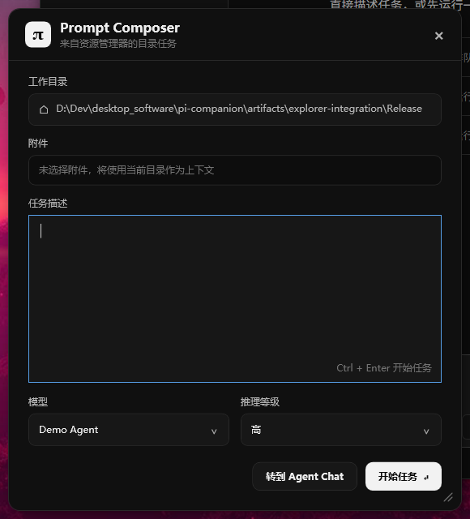

# 阶段 1：可运行桌面外壳

> 历史交付快照：本文记录阶段 1 完成时的实现、测试和限制，不代表当前 `main`。当前入口见 [`docs/README.md`](README.md)。

## 交付状态

阶段 1 的工程骨架和首个可运行垂直切片已经完成。桌面进程持有三个主要界面，Vue 与 C# 通过版本化 Bridge 双向通信，Monitor 与 Agent Chat 由同一个 `TaskProjection` 驱动。Agent Chat 已收敛为黑白、低装饰的 Agent 工作台结构：任务侧栏、单一会话区和固定输入框；原生窗口标题栏也使用深色 DWM 样式，与应用主体保持一致。

## 用户可见成果

- 托盘图标支持打开 Agent Chat、显示/隐藏 Monitor、快速 Demo 和退出；Agent Chat 右上角以“更多”按钮承载 Monitor toggle 和退出入口。Prompt Composer 只由 Explorer 激活链路调用。
- Prompt Composer 支持工作目录、附件、任务输入、模型、推理等级、取消、转到聊天和开始工作，并使用完整的深色控件样式。
- Monitor 支持 Capsule/Expanded、显式展开与收起、拖动、Steer/Follow-up 输入和结果确认。新的授权或提问请求到达时自动展开一次；普通状态刷新不会改变形态，用户仍可在等待期间手动收起。
- Monitor 的主内容按状态互斥显示活动、交互请求或结果。左键双击打开 Agent Chat；右键菜单提供“新建任务”“隐藏 Monitor”和“退出 Pi Companion”。
- Monitor 只在用户直接点击输入框时赋予输入焦点；点击标题、元数据、状态内容或按钮不会把焦点转移到输入框。
- Agent Chat 已使用 Vue 3、TypeScript、Pinia 和 Vite 构建，并通过本地虚拟 Host 加载到标准 `WebView2`；视觉只用中性色和少量语义状态色，不再使用渐变、发光或装饰性指标卡。
- Agent Chat 侧栏当前只保留“任务”和“任务历史”；历史分组显示“最近”，任务项右键菜单预留“重命名”和“删除”，设置入口使用与工作区导航一致的全宽按钮。用户消息靠右并按文字内容决定气泡宽度。
- Agent Chat 输入区提供真实的模型与推理等级下拉框；运行期间锁定当前 Run 的配置，结束后可为下一次执行重新选择。
- Agent Chat 的两级 Grid、侧栏历史和会话区都有独立高度约束；窗口缩到最小高度时内部滚动，不会由新消息反向撑大宿主窗口。
- Demo Run 可经过 `Queued → Starting → Running → WaitingForApproval → Completed`，也可进入失败和中止状态。
- WPF 与 Vue 支持 `BridgeReady`、`InitializeSnapshot`、`AppendEvents`、`TaskUpdated`、`NewTask`、`SendPrompt`、`Steer`、`FollowUp`、`AbortRun` 和 `ResolveInteraction`。




## 操作与验收步骤

1. 运行 `scripts/build.ps1 -Configuration Debug`。
2. 运行 `scripts/run.ps1 -NoBuild`。
3. 确认 Agent Chat、右上角 Monitor Capsule 和系统托盘图标出现。
4. 点击侧栏“新建任务”或按 `Ctrl+N`，确认 Agent Chat 直接进入空白任务且不会打开 Prompt Composer。
5. 在 Agent Chat 中分别点击“成功流程”“权限流程”和“失败流程”。
6. 在权限流程中从 Monitor 或 Chat 选择“允许一次”或“拒绝”，确认两个界面同步更新。
7. 单击 Capsule 的“展开”按钮进入 Expanded；单击 Expanded 标题栏中的“收起”按钮返回 Capsule。新的授权或提问请求应自动展开一次；随后手动收起时，同一请求的状态刷新不应反复展开。
8. 使用左键拖动 Capsule 或 Expanded 标题区域，确认位置保持；拖动区域保持普通箭头光标。左键双击 Monitor 确认打开 Agent Chat。
9. 分别在 Capsule 和 Expanded 的可拖动区域右键，确认菜单稳定显示“新建任务”“隐藏 Monitor”和“退出 Pi Companion”，且不触发拖动、展开或打开 Chat。
10. 展开 Monitor 后依次点击标题、元数据、状态内容和按钮，确认输入框不获得焦点；直接点击输入框时仍可正常输入。
11. 在 Agent Chat 右上角“更多”菜单和托盘菜单中各连续触发两次 Monitor toggle，确认第一次隐藏、第二次显示；“更多”菜单应与按钮右边缘对齐。
12. 使用 `--explorer-preview` 打开 Prompt Composer，确认下拉框、按钮和弹出列表均为深色样式。
13. 在任务运行期间切换到其他窗口，确认后台状态刷新不激活 Monitor，也不改变用户选择的展开/收起状态。
14. 将 Agent Chat 缩到最小高度并运行完整 Demo，确认窗口尺寸保持不变，会话区和任务历史各自出现滚动条。
15. 在侧栏任务项上右键，确认“重命名”和“删除”占位菜单出现；设置入口应与工作区按钮等宽。

## 自动化验证

当前自动化结果：

```text
Vue typecheck + production build: passed
.NET Release build: 0 warnings, 0 errors
xUnit: 20 passed, 0 failed
Runtime smoke: Agent Chat and Monitor visible; WebView2 child process running; Bridge online
Runtime interaction: explicit Monitor expand/collapse, right-click menu and show/hide toggle passed; non-input clicks keep focus on the Monitor window; dark native title bar verified
```

测试覆盖：

- Run 内 Sequence 严格递增。
- 重复事件和其他 Run 的事件被投影忽略。
- 活动投影有界。
- Demo 成功流程以 settled 结束。
- 权限流程必须先 Resolve 才能 settled。
- 失败流程保留 `Failed` 终态。
- 新建任务只清理已结束的投影，并拒绝覆盖仍在运行的任务。
- Monitor 可关闭已结束 Run 的结果卡片并回到无任务显示，不改变 Run 终态或 Chat 会话。

## 关键实现决定

- 目标框架为 `net10.0-windows10.0.22000.0`。Agent Chat 使用标准 WPF `WebView2` 以改善窗口缩放流畅度；初始化和导航期间先隐藏原生子窗口，成功后再切换加载面板与 WebView，避免 airspace 遮挡。
- Monitor 使用 `ShowActivated=False`，投影事件处理只刷新内容，不调用 `Activate()`。
- Monitor 平时只由用户显式控制展开状态；每个新的 `WaitingForApproval` / `WaitingForAnswer` 交互请求会按 Interaction ID 自动展开一次，但不激活窗口，同一请求不会覆盖用户后续的手动收起。
- 主窗口保留系统窗口框架与缩放行为，通过 DWM Caption/Border/Text Color 使用深色标题栏。
- WebView2 只加载 `https://app.pi-companion.local`，Vue 资源带 CSP，未知导航被 WPF 拦截。
- `TaskProjection` 是两个 UI 的共同读模型；Vue/Monitor 不各自决定任务真相。
- `DemoAgentBackend` 实现 `IAgentBackend`，阶段 3 可替换为 `PiRpcBackend`。

## 已知限制

- 当前任务、事件和 Draft 只在内存中，SQLite 与重启恢复属于阶段 3。
- 权限卡片目前只模拟交互，执行端强制权限属于阶段 4。
- 文件 Diff、真实测试证据和恢复属于阶段 6。
- 任务右键菜单中的“重命名”和“删除”当前只有界面占位，持久化操作随阶段 3/5 的任务存储与完整历史实现。
- 尚未执行完整的多显示器 DPI 场景矩阵，只实现了 PerMonitorV2 和按目标显示器物理像素定位。
- Debug 构建依赖已安装的 .NET 10 Desktop Runtime；安装阶段会改为自包含或由 MSIX 声明运行时依赖。

阶段 1 最初记录的 Explorer 现代右键菜单、Named Pipe 激活、鼠标定位和第二实例 Payload 转交，均已在阶段 2 完成。

## 主要修改文件

- `PiCompanion.sln`、`Directory.Build.props`、`Directory.Packages.props`、`global.json`
- `src/PiCompanion.Core/**`
- `src/PiCompanion.Application/Demo/**`
- `src/PiCompanion.Desktop/**`
- `src/PiCompanion.Chat/**`
- `tests/PiCompanion.Core.Tests/**`
- `scripts/build.ps1`、`scripts/run.ps1`

## 后续阶段承接

阶段 2 已在不改变领域状态主干的前提下接入 C++ `IExplorerCommand`、Named Pipe Activation、选择项解析、Composer 附件及目标显示器定位。阶段 3 将保留 `IAgentBackend` 边界，用真实 `PiRpcBackend`、SQLite Event Store 和 Session 恢复替换当前 `DemoAgentBackend`；阶段 1/2 尚不包含 Pi Runtime 发现、下载或发布逻辑。
