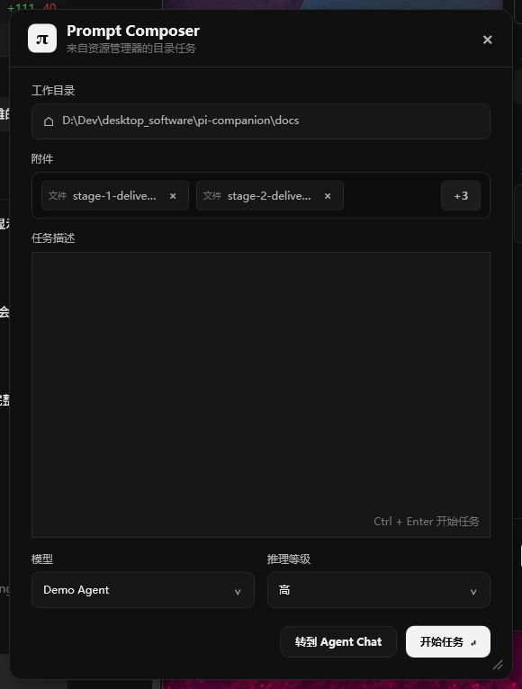

# 阶段 2：Explorer 到 Composer

## 交付结果

阶段 2 已打通完整激活链路：Windows 11 File Explorer 通过原生 x64 `IExplorerCommand` 提供 `Ask Pi Companion`，收集工作目录、选中项、鼠标坐标和 Explorer 窗口句柄；请求优先写入当前用户专属 Named Pipe，桌面端收到后在目标显示器工作区内把 Prompt Composer 放到鼠标附近。没有现有实例时，扩展使用受限的一次性激活文件启动桌面应用，文件读取后立即删除。

Composer 现已支持文件和文件夹附件。用户可以直接启动 `DemoAgentBackend` 模拟任务，也可以把完整 Draft 带入 Agent Chat。取消只隐藏 Composer；“转到 Agent Chat”只载入 Draft，直到用户在 Chat 中发送内容才创建 Run。



## Explorer 场景

稀疏开发包清单为同一个 COM CLSID 注册三个现代菜单上下文：

| Explorer 场景 | Manifest ItemType | 激活结果 |
|---|---|---|
| 文件 | `*` | 当前目录 + 文件附件 |
| 明确选中的文件夹 | `Directory` | 父目录作为工作目录 + 所选文件夹附件 |
| 多选 | Shell item array | 当前目录 + 最多 64 个去重附件 |
| 目录空白区域 | `Directory\Background` | 当前目录，无附件 |

Shell 某些调用会把正在浏览的当前目录同时放入选中项。桌面端规范化时会剔除与 `workingDirectory` 相同的路径，因此“在文件夹内调用”只设置工作目录，不会把该目录误当附件；只有像文件一样明确选中的子文件夹才保留为附件。

原生扩展不初始化模型、数据库或 WebView2。`GetTitle`、`GetState` 等菜单构建方法只返回静态数据；`Invoke` 对 Shell item 做有界解析后，将 Pipe/启动工作投递到 Shell 后台线程。

## 协议和边界

激活 JSON 使用协议版本 1，字段包括：

```text
protocolVersion
requestId
workingDirectory
selectedPaths[]
cursorPosition { x, y }
explorerWindowHandle
invocationKind
timestamp
```

桌面端限制 Payload 为 256 KiB、选中项为 64 个，要求绝对路径、有效 UTF-8、非空 requestId 和 UTC 时间戳。路径在桌面端规范化并按 Windows 大小写语义去重；Shell 扩展不递归扫描目录。Named Pipe 名包含当前用户 SID，服务端同时启用 `CurrentUserOnly`。

一次性激活文件只允许位于 `%LOCALAPPDATA%\PiCompanion\activations` 的直接子文件，文件名必须是 GUID，且拒绝重解析点。

## Composer 行为

- 鼠标坐标可用时以鼠标为锚点；不可用时回退到 Explorer 窗口中心，再回退到当前光标。
- 根据锚点所在显示器的 WorkArea 和 DPI 计算像素尺寸；优先右下显示，越界时翻转到左侧或上方，并最终钳制到 WorkArea。
- 附件区使用固定高度的单行紧凑 Chip，并按窗口宽度横向排列；一行无法完整容纳时保留尽可能多的附件，并以“+N”Chip 表示被折叠的剩余项，不出现滚动条。附件可在提交前移除，完整路径及折叠项清单通过深色高对比 Tooltip 显示。
- 开始任务前验证工作目录、附件和 Prompt；附件快照进入模拟 Task/Run。
- 打开 Chat 只验证目录和附件，允许空 Prompt Draft，不启动模拟 Agent。
- 工作目录区域按内容自适应高度，不占用附件或任务描述空间。
- Composer 使用位于窗口内部的自定义右下角拉伸把手；最小尺寸下任务描述边框、底部选项和操作按钮保持在窗口范围内。

## 构建与开发注册

完整构建现在同时编译 .NET/Vue、x64 原生 Explorer DLL 和原生 COM 冒烟程序：

```powershell
.\scripts\build.ps1 -Configuration Release
```

生成可注册的外部位置：

```powershell
.\scripts\build-explorer-integration.ps1 -Configuration Release -NoBuild
```

输出位于 `artifacts\explorer-integration\Release`。`makeappx` 可用该目录生成并验证 MSIX 结构；开发注册使用 `AppxManifest.xml` 和 `Add-AppxPackage -Register -ExternalLocation`。

注册或更新当前用户开发包：

```powershell
.\scripts\install-explorer-integration.ps1 -Configuration Release -NoBuild
```

未签名稀疏开发包要求 Windows 开发人员模式或旁加载策略。安装脚本会先检查策略，并明确失败，不会自动修改系统安全设置。正式签名、安装、升级和卸载流程仍按产品计划归入阶段 7。

## 自动化与冒烟结果

- .NET Release 构建：0 warning / 0 error。
- xUnit：20 项通过；激活协议、Unicode/长路径、限制、路径去重、当前工作目录不作为附件、明确选择的子文件夹保留为附件、附件快照、边缘翻转和多屏负坐标均覆盖。
- Vue：`vue-tsc --noEmit` 与 Vite production build 通过。
- 原生 x64 DLL：MSVC C++20 Release 构建通过。
- 原生 COM 冒烟：`DllGetClassObject`、`IExplorerCommand::GetTitle` 和 `GetState` 通过。
- 进程级冒烟：第二个桌面进程读取临时激活文件后退出，请求由 Named Pipe 转发给唯一现有实例，临时文件被删除；UI Automation 确认 Composer 收到文件和文件夹附件。
- 原生 Invoke 冒烟：两项 Shell item array 经 C++ 扩展发送到桌面 Pipe；UI Automation 确认两个附件进入 Composer，桌面进程仍保持单实例。
- Package manifest：`makeappx pack` 验证通过；`PiCompanion.Development` 已以外部位置开发包注册，状态为 `Ok`。

## 当前环境与发布边界

本机已启用开发人员模式，未签名稀疏开发包已成功注册，真实 Explorer 菜单和第二实例转交链路可用。更新扩展 DLL 或菜单标题后，Explorer 可能继续使用进程内缓存，需要重启 Windows Explorer 或重新登录。

当前注册方式仅用于开发验证。正式代码签名、安装、升级和卸载仍按产品计划归入阶段 7。

## 对阶段 3 的交接

阶段 2 仍使用 `DemoAgentBackend`，当前开发 MSIX 不包含 Pi Runtime。阶段 3 将实现可显式指定开发机 Pi 路径的 Runtime Resolver、真实 Pi RPC、SQLite 和 Session 恢复；正式发布默认使用锁定版本的应用私有 Pi Runtime，轻量包首次下载可作为后续可选分发模式，不静默回退到用户全局 Pi。
